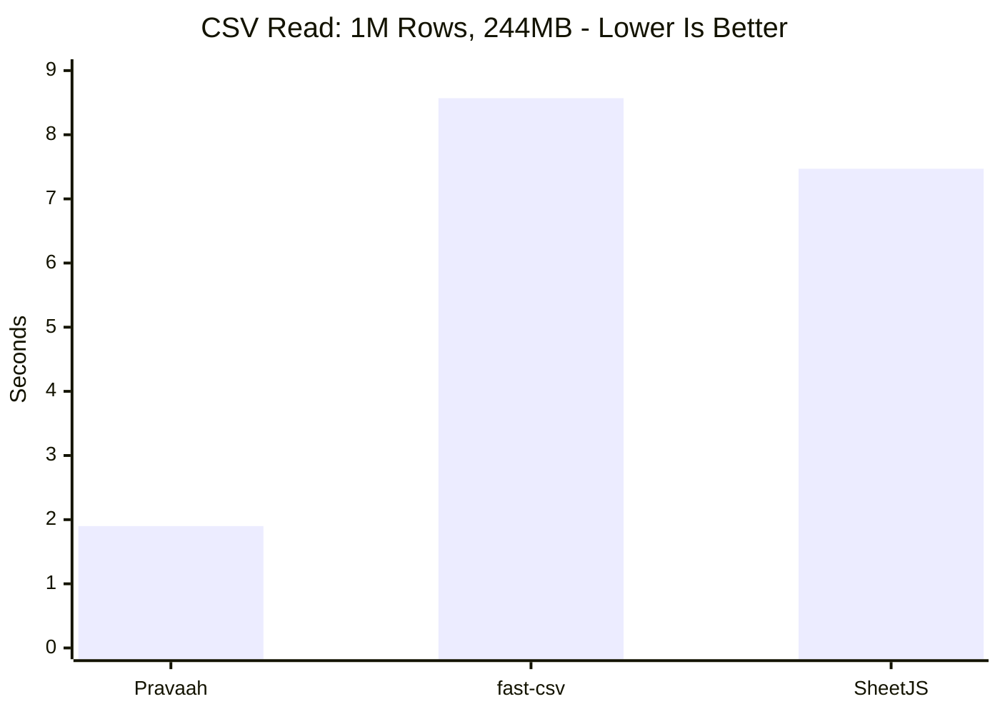
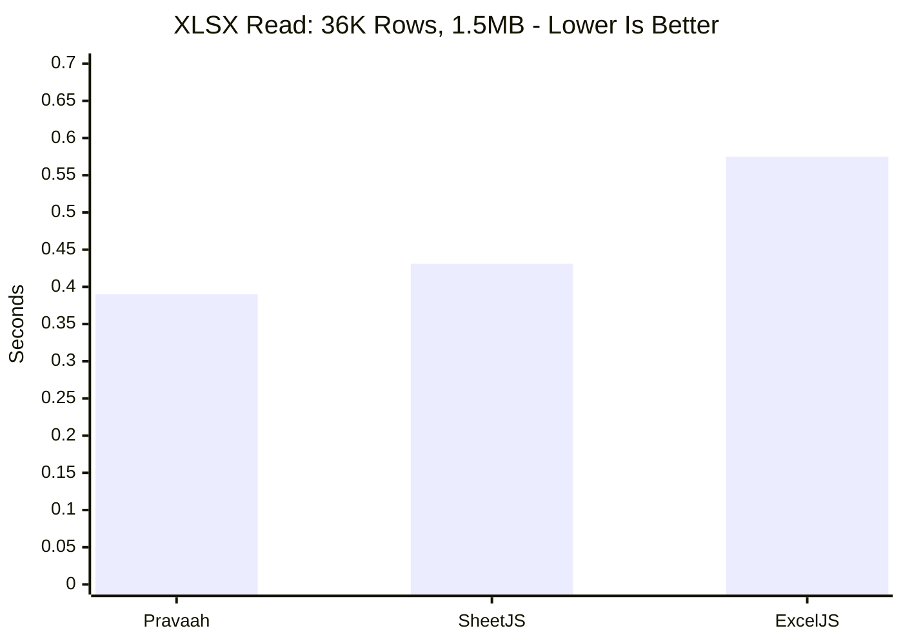
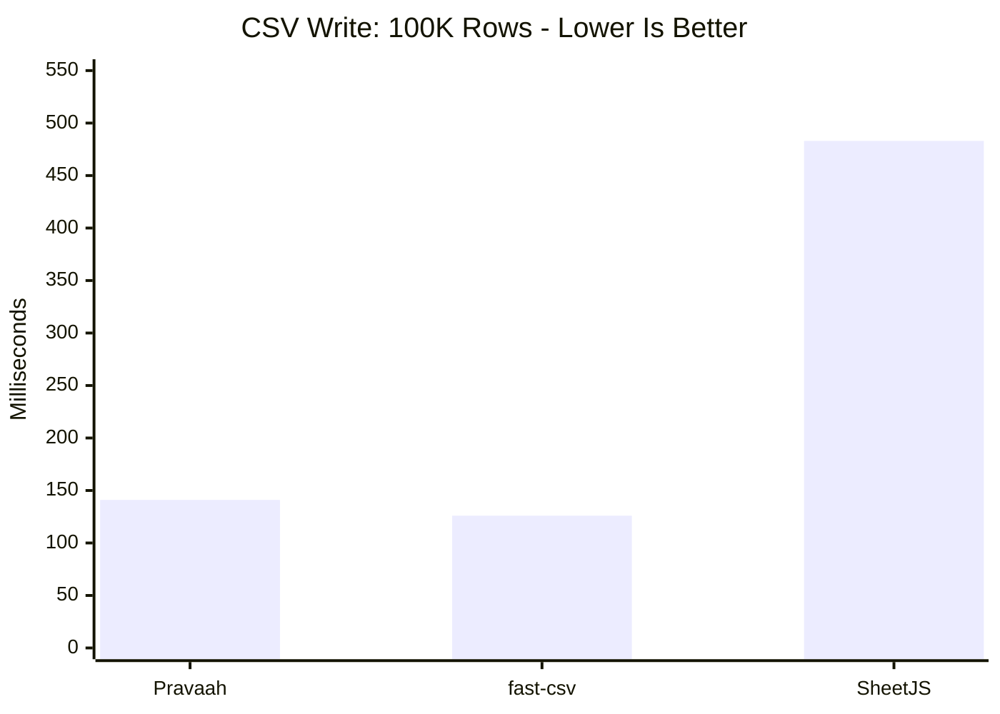
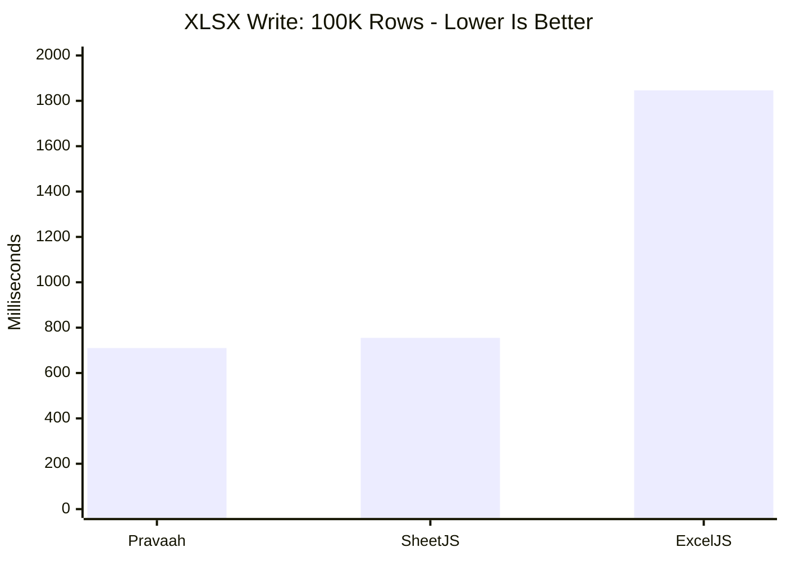
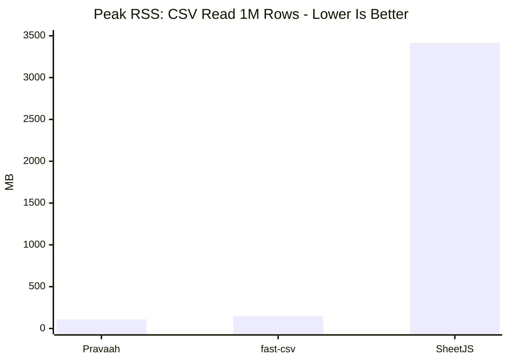
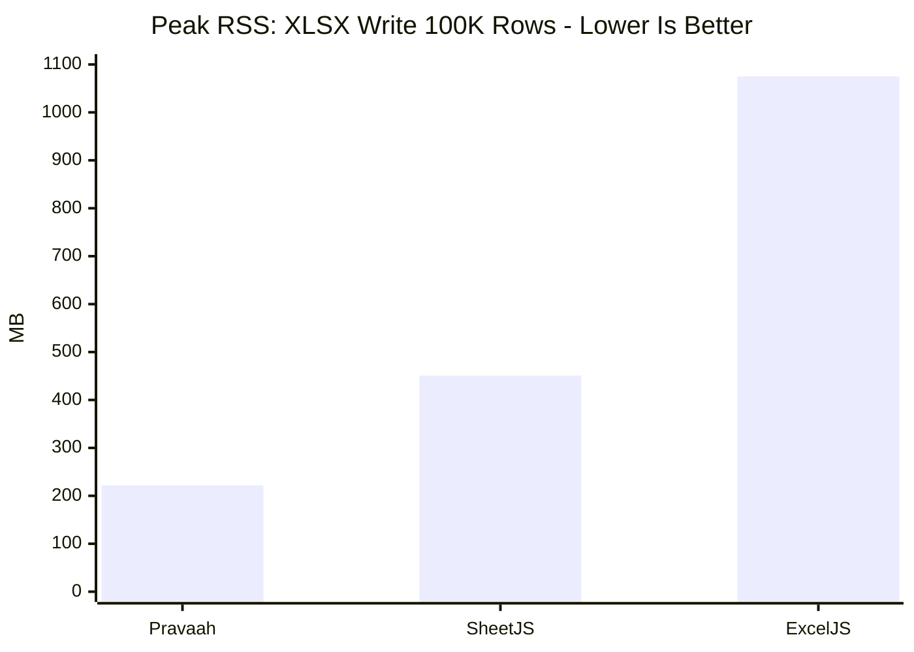

# Pravaah

Production-grade Excel, CSV, and JSON pipelines for Node.js.

Pravaah turns spreadsheets into typed, validated, streaming data pipelines. It is built for backend import jobs, ETL flows, customer uploads, audits, and data products where spreadsheet files are large, messy, and business-critical.

```ts
import { read, schema } from "pravaah";

const leads = await read("leads.xlsx")
  .clean({
    trim: true,
    normalizeWhitespace: true,
    fuzzyHeaders: {
      email: ["E-mail", "email id", "mail"],
      company: ["Company Name", "account"],
    },
  })
  .schema({
    email: schema.email(),
    company: schema.string(),
    employees: schema.number({ optional: true }),
    joinedAt: schema.date({ optional: true }),
  })
  .filter((lead) => lead.email.endsWith("@example.com"))
  .collect();
```

## Why Pravaah

Most Node.js spreadsheet libraries are file manipulation libraries. They help you read cells or write workbooks, but leave ingestion, validation, cleanup, diagnostics, and memory control to your application.

Pravaah is different. It treats every spreadsheet as a data contract and every import as a pipeline.

- Stream large CSV/XLSX files without loading the entire dataset into memory.
- Validate rows with TypeScript-inferred schemas.
- Clean messy headers and whitespace before data reaches your database.
- Query, diff, join, transform, and write data using one API.
- Preserve formulas and build workbooks when you need XLSX output.
- Measure throughput and RSS with reproducible benchmarks.

## Install

```sh
npm install pravaah
```

Requirements:

- Node.js 20 or newer.
- ESM project or compatible bundler/runtime.

## Quick Start

### Read A File

```ts
import { read } from "pravaah";

for await (const row of read("customers.csv")) {
  console.log(row);
}
```

Pravaah auto-detects `.csv`, `.xlsx`, and `.json` from the file extension. You can also force a format:

```ts
const rows = await read(buffer, { format: "xlsx", sheet: "Customers" }).collect();
```

### Transform And Write

```ts
import { read, schema } from "pravaah";

const stats = await read("orders.csv")
  .schema({
    orderId: schema.string(),
    email: schema.email(),
    total: schema.number(),
  })
  .filter((row) => row.total > 100)
  .map((row) => ({
    ...row,
    status: "priority",
  }))
  .write("priority-orders.xlsx", {
    sheetName: "Priority Orders",
  });

console.log(stats.rowsWritten, stats.durationMs);
```

### Parse With A Schema

```ts
import { parse, schema } from "pravaah";

const orders = await parse(
  "orders.csv",
  {
    orderId: schema.string(),
    email: schema.email(),
    total: schema.number({
      validate: (value) => (value < 0 ? "total cannot be negative" : undefined),
    }),
    paid: schema.boolean({ defaultValue: false }),
  },
  {
    format: "csv",
    validation: "fail-fast",
  },
);

// orders is inferred as:
// Array<{ orderId: string; email: string; total: number; paid: boolean }>
```

### Collect Validation Issues

```ts
import { parseDetailed, schema, writeIssueReport } from "pravaah";

const result = await parseDetailed(
  "contacts.xlsx",
  {
    email: schema.email(),
    phone: schema.phone({ optional: true }),
    source: schema.string({ defaultValue: "upload" }),
  },
  {
    validation: "collect",
    cleaning: {
      trim: true,
      fuzzyHeaders: {
        email: ["E-mail Address", "mail"],
        phone: ["mobile", "phone number"],
      },
    },
  },
);

await writeIssueReport(result.issues, "import-issues.csv");
console.log(result.rows.length, result.issues.length);
```

### Count Rows Without Materializing Them

```ts
import { read } from "pravaah";

const stats = await read("large-file.csv").drain();

console.log(`Processed ${stats.rowsProcessed} rows`);
```

For CSV files, `drain()` uses a raw record-boundary scanner when no transforms are attached. It counts rows without allocating row objects.

## Core Concepts

### Streaming Pipelines

`read()` returns a lazy `PravaahPipeline`.

```ts
import { read, schema } from "pravaah";

const pipeline = read("input.csv")
  .clean({ trim: true })
  .schema({
    email: schema.email(),
    name: schema.string({ optional: true }),
  })
  .map((row) => ({ ...row, importedAt: new Date().toISOString() }))
  .filter((row) => row.email.endsWith("@example.com"))
  .take(10_000);

const rows = await pipeline.collect();
```

Available pipeline methods:

- `.map(fn)` transforms rows.
- `.filter(fn)` keeps matching rows.
- `.clean(options)` normalizes row values and headers.
- `.schema(definition, options)` validates and types rows.
- `.take(limit)` stops after a fixed number of rows.
- `.collect()` materializes rows into an array.
- `.process()` returns rows, issues, and stats.
- `.drain()` consumes rows without storing them.
- `.write(destination, options)` writes the pipeline output.

Adjacent `.map()` and `.filter()` calls are fused into a single iteration pass to reduce per-row async overhead.

### Schemas

Schemas validate incoming rows and infer TypeScript types.

```ts
import { schema } from "pravaah";

const userSchema = {
  id: schema.string(),
  name: schema.string({ validate: (value) => (value.length < 2 ? "name too short" : undefined) }),
  age: schema.number({ optional: true }),
  active: schema.boolean({ defaultValue: true }),
  signupDate: schema.date(),
  email: schema.email(),
  phone: schema.phone({ optional: true }),
  metadata: schema.any({ optional: true }),
};
```

Field options:

- `optional`: allow missing, `null`, or empty values.
- `defaultValue`: use a fallback when the cell is empty.
- `coerce`: convert spreadsheet strings into typed values.
- `validate`: add domain-specific validation.

Validation modes:

- `fail-fast`: throw on the first invalid row.
- `collect`: keep valid rows and collect/report issues.
- `skip`: skip invalid rows without warnings.

### Cleaning

```ts
import { read } from "pravaah";

const rows = await read("customers.csv")
  .clean({
    trim: true,
    normalizeWhitespace: true,
    dedupeKey: ["email", "accountId"],
    fuzzyHeaders: {
      email: ["E-mail", "Email Address", "mail"],
      accountId: ["Account ID", "acct id"],
    },
  })
  .collect();
```

Cleaning supports trimming, whitespace normalization, fuzzy header mapping, and deduplication by one or more keys.

## File Formats

### CSV

```ts
import { read } from "pravaah";

const rows = await read("data.csv", {
  headers: true,
  delimiter: ",",
  inferTypes: true,
}).collect();

await read("data.csv").write("copy.csv", {
  headers: ["id", "email", "total"],
});
```

CSV features:

- Streaming parser built for backend ingestion.
- RFC-style quoted fields, escaped quotes, and CRLF handling.
- `headers: true`, `headers: false`, or explicit header arrays.
- Single-character custom delimiters.
- Optional primitive inference for numbers, booleans, and nulls.
- Backpressure-aware CSV writing.

### XLSX

```ts
import { read } from "pravaah";

const rows = await read("workbook.xlsx", {
  sheet: "Invoices",
  formulas: "preserve",
}).collect();
```

XLSX read features:

- Sheet selection by name or index.
- Selective zip decompression of only required workbook entries.
- Lazy shared-string resolution.
- Buffer-based worksheet XML scanning.
- Formula preservation with `{ formula, result }` cells.

### JSON

```ts
import { read } from "pravaah";

const rows = await read("rows.json", { format: "json" }).collect();
await read(rows).write("rows.json", { format: "json" });
```

JSON support is useful for fixtures, snapshots, intermediate ETL files, and tests.

## Workbook Authoring

Use `write()` for simple row exports. Use workbook helpers when you need multiple sheets, formulas, column widths, merges, data validations, auto-filters, or frozen panes.

```ts
import { formula, workbook, worksheet, writeWorkbook } from "pravaah";

const summary = worksheet("Summary", [
  { metric: "Revenue", value: 125000 },
  { metric: "Target", value: 100000 },
  { metric: "Delta", value: formula("B2-B3", 25000) },
]);

summary.columns = [
  { header: "metric", width: 24 },
  { header: "value", width: 16 },
];
summary.merges = ["A1:B1"];
summary.frozen = { ySplit: 1, topLeftCell: "A2" };
summary.validations = [{ range: "B2:B100", type: "decimal", formula: "0" }];
summary.tables = [{ name: "SummaryTable", range: "A1:B4", columns: ["metric", "value"] }];

const book = workbook([summary]);
book.properties.creator = "Pravaah";

await writeWorkbook(book, "report.xlsx");
```

## Query Data

```ts
import { query } from "pravaah";

const topAccounts = await query(
  "accounts.csv",
  "SELECT id, name, revenue WHERE revenue >= 100000 ORDER BY revenue DESC LIMIT 25",
);
```

Supported SQL-like clauses:

- `SELECT *` or a comma-separated column list.
- `WHERE` with `=`, `!=`, `>`, `>=`, `<`, `<=`, and `contains`.
- `ORDER BY column ASC|DESC`.
- `LIMIT n`.

For in-memory joins and lookups:

```ts
import { createIndex, joinRows } from "pravaah";

const byCustomer = createIndex(customers, "customerId");
const enrichedOrders = joinRows(orders, customers, "customerId");
```

## Diff Datasets

```ts
import { diff, read, writeDiffReport } from "pravaah";

const previous = await read("customers-before.csv").collect();
const current = await read("customers-after.csv").collect();

const result = diff(previous, current, { key: "customerId" });

await writeDiffReport(result, "customer-diff.csv");
```

The diff result contains added rows, removed rows, changed rows with changed columns, and an unchanged count.

## Formula Engine

```ts
import { FormulaEngine, evaluateFormula } from "pravaah";

const total = evaluateFormula("SUM(subtotal, tax)", {
  subtotal: 100,
  tax: 8.25,
});

const engine = new FormulaEngine({
  functions: {
    DISCOUNT: ([amount, percent]) => Number(amount) * (1 - Number(percent)),
  },
});

const discounted = engine.evaluate("DISCOUNT(total, 0.15)", { total: 200 });
```

Built-in functions:

- `SUM`
- `AVERAGE`
- `MIN`
- `MAX`
- `COUNT`
- `IF`
- `CONCAT`

Simple arithmetic expressions such as `subtotal + tax` are also supported.

## Plugins

```ts
import { FormulaEngine, plugins } from "pravaah";

plugins.use({
  name: "business-rules",
  validators: [
    (row) =>
      Number(row.total) < 0
        ? [
            {
              code: "negative_total",
              message: "total cannot be negative",
              column: "total",
              rawValue: row.total,
              expected: ">= 0",
              severity: "error",
            },
          ]
        : [],
  ],
  formulas: {
    MARGIN: ([revenue, cost]) => Number(revenue) - Number(cost),
  },
});

const issues = plugins.validate({ total: -10 });
const engine = new FormulaEngine({ functions: plugins.formulas() });
```

Plugins can provide validators, parsers, exporters, and formula functions.

## Parallel Mapping

```ts
import { read, workerMap } from "pravaah";

const rows = await read("large.csv", { inferTypes: true }).collect();

const enriched = await workerMap(
  rows,
  `(row) => ({
    ...row,
    score: Number(row.revenue ?? 0) * 0.12
  })`,
  { concurrency: 4 },
);
```

`workerMap()` is useful for CPU-heavy row transformations. The mapper is passed as a JavaScript function string and executed in Node worker threads.

## API Reference

### Top-Level Functions

| API | Purpose |
| --- | --- |
| `read(source, options)` | Create a lazy pipeline from CSV, XLSX, JSON, Buffer, Iterable, or AsyncIterable input. |
| `write(rows, destination, options)` | Write rows to CSV, XLSX, or JSON. |
| `parse(source, schema, options)` | Read, validate, and collect typed rows. |
| `parseDetailed(source, schema, options)` | Read and validate with rows, issues, and stats. |
| `query(source, sql)` | Run SQL-like queries over row data. |
| `diff(oldRows, newRows, options)` | Compare datasets by key. |
| `writeIssueReport(issues, destination)` | Write validation diagnostics as CSV. |
| `writeDiffReport(result, destination)` | Write diff diagnostics as CSV. |
| `readWorkbook(source, options)` | Load a full XLSX workbook model. |
| `writeWorkbook(workbook, destination, options)` | Write a full XLSX workbook model. |
| `workerMap(rows, mapperSource, options)` | Run parallel row mapping in worker threads. |

### Read Options

| Option | Description |
| --- | --- |
| `format` | Force `xlsx`, `csv`, or `json`. |
| `sheet` | XLSX sheet name or zero-based sheet index. |
| `headers` | `true`, `false`, or explicit header names. |
| `delimiter` | CSV delimiter. Must be one character. |
| `inferTypes` | Convert CSV strings into primitive values. |
| `formulas` | Use formula cached values or preserve formula cells. |
| `validation` | `fail-fast`, `collect`, or `skip`. |
| `cleaning` | Inline cleaning options. |

### Write Options

| Option | Description |
| --- | --- |
| `format` | Force `xlsx`, `csv`, or `json`. |
| `sheetName` | Output XLSX worksheet name. |
| `headers` | Explicit output column order. |
| `delimiter` | CSV output delimiter. |

## Benchmarks

Benchmarks are included as runnable scripts, not hidden marketing claims. Every engine runs in a fresh Node.js process so RSS measurements are not contaminated by prior runs.

```sh
npm run benchmark:isolated
```

Environment used for the published numbers:

- macOS Darwin 25.4.0, Apple Silicon.
- Node.js v22.
- Fresh child process per engine.
- RSS sampled every 25ms.
- Best of three runs.
- Dataset names are intentionally anonymized; comparisons use row counts and file sizes only.

### Read Throughput





| Workload | Engine | Time | Peak RSS |
| --- | --- | ---: | ---: |
| CSV read, 1M rows, 244MB | Pravaah | **1.90s** | **110MB** |
| CSV read, 1M rows, 244MB | fast-csv | 8.57s | 149MB |
| CSV read, 1M rows, 244MB | SheetJS | 7.47s | 3,413MB |
| CSV read, 1K rows, 498KB | Pravaah | **8ms** | **84MB** |
| CSV read, 1K rows, 498KB | fast-csv | 28ms | 95MB |
| CSV read, 1K rows, 498KB | SheetJS | 103ms | 124MB |
| XLSX read, 36K rows, 1.5MB | Pravaah | **390ms** | **123MB** |
| XLSX read, 36K rows, 1.5MB | SheetJS | 431ms | 234MB |
| XLSX read, 36K rows, 1.5MB | ExcelJS | 575ms | 295MB |

For count-only CSV probes, `read(csv).drain()` scanned 1M rows / 244MB in **760ms** with **114MB** peak RSS by counting record boundaries without parsing cells.

### Write Throughput





| Workload | Engine | Time | Peak RSS |
| --- | --- | ---: | ---: |
| CSV write, 100K rows | Pravaah | **141ms** | **138MB** |
| CSV write, 100K rows | fast-csv | 126ms | 166MB |
| CSV write, 100K rows | SheetJS | 483ms | 315MB |
| XLSX write, 100K rows | Pravaah | **710ms** | **222MB** |
| XLSX write, 100K rows | SheetJS | 755ms | 451MB |
| XLSX write, 100K rows | ExcelJS | 1,846ms | 1,075MB |

### Memory Comparison





### Benchmark Summary

| Workload | Result |
| --- | --- |
| CSV read, 1M rows | Pravaah is **4.5x faster** and uses **26% less memory** than fast-csv. |
| CSV write, 100K rows | Pravaah is close to fast-csv throughput and uses **17% less memory**. |
| XLSX read, 36K rows | Pravaah is **10% faster** and uses **47% less memory** than SheetJS. |
| XLSX write, 100K rows | Pravaah is **6% faster** and uses **51% less memory** than SheetJS. |

## How The Performance Works

### CSV

- Custom streaming parser on the read path.
- Raw record-boundary scanner for count-only drains.
- No heavyweight CSV parser dependency in the hot read path.
- Backpressure-aware writes through `@fast-csv/format`.

### XLSX

- Selective decompression reads only workbook metadata, shared strings, relationships, and the targeted sheet.
- Lazy shared strings are indexed once and decoded on demand.
- Worksheet XML is scanned from raw bytes instead of building a DOM.
- Dimension-aware row preallocation avoids sparse arrays.
- XLSX output writes XML directly and zips with `fflate`.

### Pipelines

- Lazy AsyncIterable execution.
- Fused map/filter stages.
- Built-in stats for processed rows, written rows, duration, errors, warnings, sheets, and peak RSS.

## When To Use Pravaah

Pravaah is a strong fit for:

- Customer CSV/XLSX uploads.
- Admin import tools.
- Data validation before database writes.
- ETL jobs.
- Spreadsheet-backed reports.
- Large CSV row counting and preflight checks.
- Dataset comparison and audit reports.
- TypeScript services that need predictable spreadsheet ingestion.

Pravaah is not trying to be a complete Excel desktop clone. If your main goal is pixel-perfect spreadsheet styling, charts, drawings, macros, or arbitrary workbook editing, a workbook-manipulation library may be a better primary tool.

## Scripts

```sh
npm run build
npm run typecheck
npm test
npm run coverage
npm run lint
npm run benchmark:isolated
```

Benchmark controls:

```sh
PRAVAAH_BENCH_WRITE_ROWS=100000 npm run benchmark:isolated
PRAVAAH_BENCH_SKIP_WRITE=1 npm run benchmark:isolated
PRAVAAH_BENCH_SKIP_READ=1 npm run benchmark:isolated
PRAVAAH_BENCH_INCLUDE_MEMORY=1 npm run benchmark:isolated
PRAVAAH_BENCH_RUNS=5 npm run benchmark:isolated
```

## Roadmap

- Broader XLSX formatting coverage.
- More formula functions.
- Streaming XLSX write for extremely large exports.
- More SQL-like query operators.
- First-party adapters for common upload and ETL frameworks.

## License

MIT
